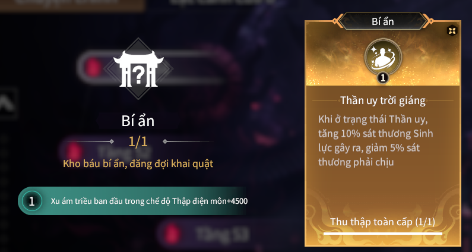

# Farm linh quyết ở cửu u

---

## Khuyến khích nên Farm các linh quyết tím và xanh
 - Hiện tại thì cửu u không ai đi cổng đỏ hết nên rất khó để Farm linh quyết vàng
 - **Chiến lược :**
   - Hãy farm các linh quyết theo bộ của nó
   ví dụ : hãy farm tất cả linh quyết liên quan đến *Cường chấn* đừng lấy các lõi không liên quan nó sẽ làm loạn bộ linh quyết cần farm
   

- Về phần *linh quyết bí ẩn* hãy cố gắng có nó càng sớm càng tốt rồi hãy đi farm các linh quyết còn lại

- Cách lấy : spam Tầng 7 hoặc cửu u. Sau đó mở hộp nguyền rủa và nhận được lạc đường.
  - Vào màn 2 boss, bên trái mình có 1 hốc đá. Hãy dụ *Qủy tiên phong* vào để Boss "*Đập đá*" hộ mình 
  - Khoảng 15 phát rìu thì đá sẽ bể để lấy linh quyết ẩn

  