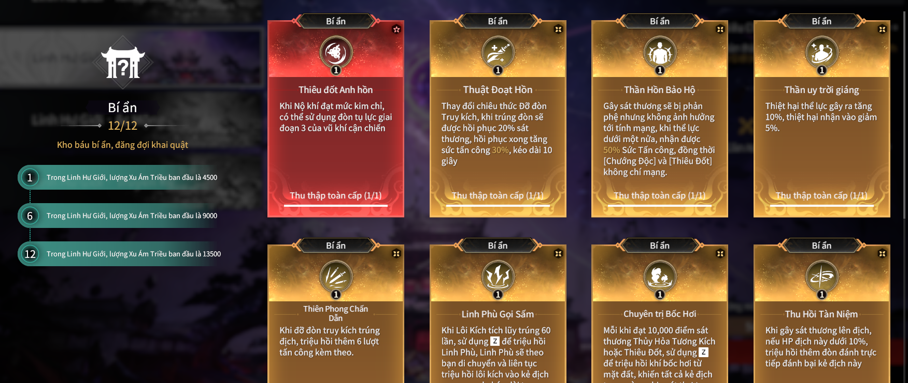
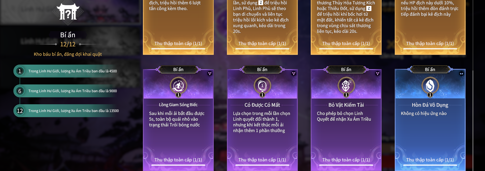

# Farm linh quyết ở linh hư giới

---

 - **Chiến lược :**
   - Hãy farm các linh quyết theo bộ của nó
   ví dụ : hãy farm tất cả linh quyết liên quan đến *Cường chấn* đừng lấy các lõi không liên quan nó sẽ làm loạn bộ linh quyết cần farm
   

- Các linh quyết bí ẩn cơ bản thì ta cứ đi linh hư giới và dựa vào vận may để mở khóa
- Về phần *Thần uy trời giáng* thì ta mở hộp nguyền rủa và nhận được lạc đường.
  - Vào màn 2 boss, bên trái mình có 1 hốc đá. Hãy dụ *Qủy tiên phong* vào để Boss "*Đập đá*" hộ mình 
  - Khoảng 15 phát rìu thì đá sẽ bể để lấy linh quyết ẩn

  

- Danh sách các linh quyết bí ẩn

  
  