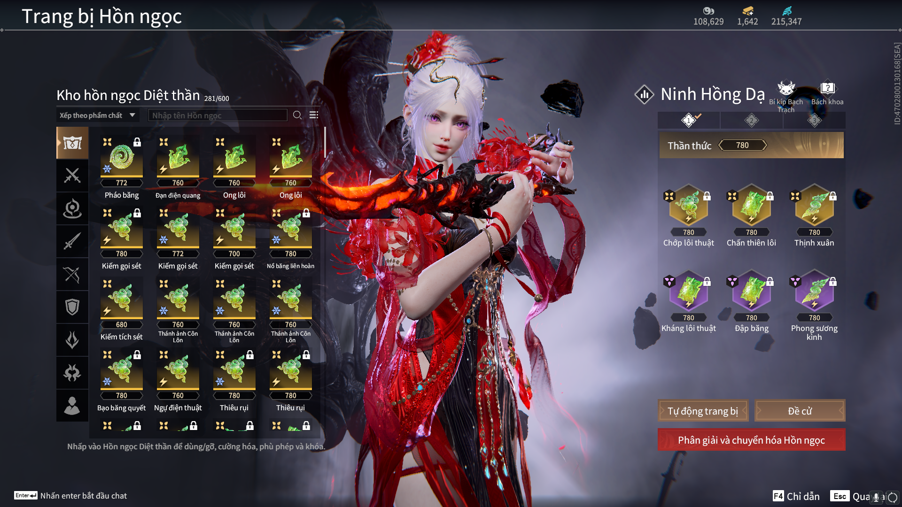
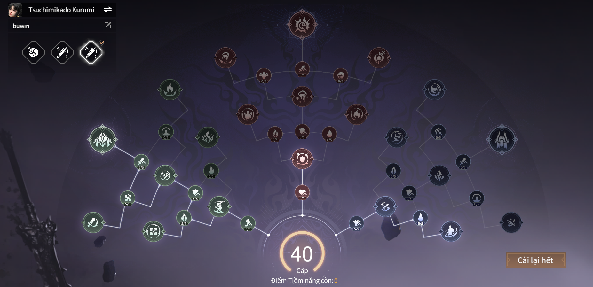

# Chấn lôi - Chớp lôi

---

  - Đây là bảng ngọc sơ khai nhất của diệt thần và bất tử qua mọi meta với sát thương nguyên tố làm chủ 
  - Thông tin bộ ngọc :
  
  - Tiềm năng:
  
  - Cách thức vận hành: Dùng ngọc Chớp Lôi Thuật để tích lũy nguyên tố thiên lôi, khi tích đầy nguyên tố sẽ có thiên lôi đánh xuống, Khi đó Chấn thiên lôi có thể đỡ thiên lôi và bắn ra sát thương thiên lôi cực cao!
  - Ưu nhược điểm: 
    - Ưu Điểm: Dễ chơi, dễ làm quen cho lewd bie, lượng sát thương ổn định không bị ảnh hưởng nhiều bởi meta! Phù hợp với tất cả các tướng! các Slot ngọc bổ trợ cho nhau tốt!
    - Nhược điểm: Các slot ngọc là cố định rất khó để có biến thể khác, yêu cầu người chơi có kỹ năng đỡ đòn ( đỡ thiên lôi chuẩn xác để có thể gây đc lượng dame tốt nhất ). Khi sử dụng hồn ngọc Phong sương kình sẽ có khả năng khiến bản thân bị đóng băng và phải dùng đập băng để xóa bỏ hiệu ứng này trước khi bị đóng băng! Khi đỡ thiên lôi có tỉ lệ bị boss tấn công bằng đòn trắng
  - Các Option cho các Bạn Tham Khảo
    - Option Hiếm: Hợp đạo (khuyếch đại sát thương thiên lôi lên cao)
    - Tăng Sát Thương Thiên Lôi ( Op dame chính của bộ ngọc)
    - Tăng Tấn công (Op cần thiết nhất của bộ ngọc)
    - Tăng sát thương lên boss ( càng cao càng tốt )