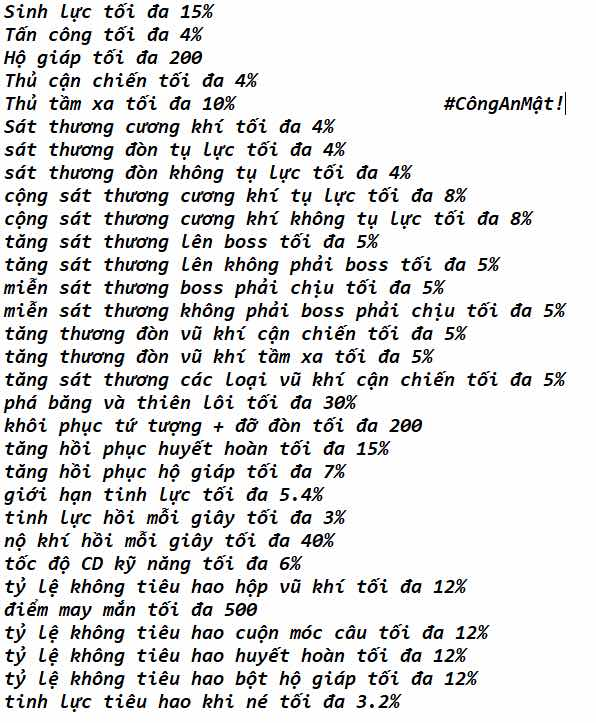

# Chọn ngọc

---

 - Khi muốn build 1 bảng ngọc hãy chọn những viên ngọc *phôi* đẹp. Hãy chọn viên có dòng gần max chỉ số hoặc đã max để đập tài nguyên để bạn đập vào bộ ngọc đó sẽ ít hao hơn. Đừng bất ngờ khi thấy các anh top server có ngọc dòng đẹp. Họ có chiến lược cả. 
 - Chọn xong rồi ta mới dùng *trác ngọc tinh* và *tôi ngọc tinh* để đập

 - Phôi xấu

 
 
 - Phôi đẹp

 
 - Có thể thấy với dòng may mắn 500 này ta có thể dùng *trác ngọc tinh* để chuyển đổi dòng thành tấn công 4% hay sinh lực 15%. 

 - Dưới đây là bảng các dòng trị số tính theo trị số cao nhất (MAX):
 - 

