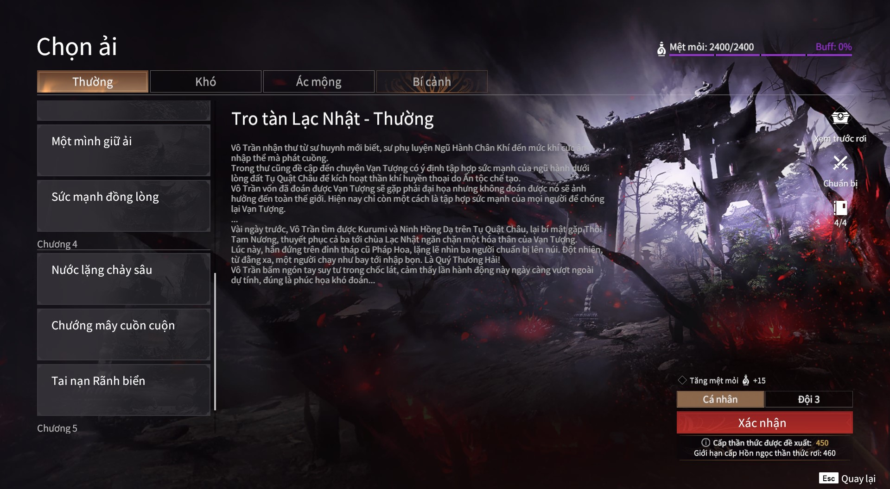
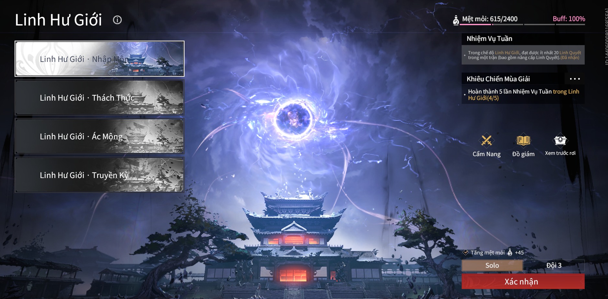

# Nâng cấp thần thức

---
  - Người mới chơi sẽ bắt đầu với thần thức lv 700
  - Lúc này các bạn nên đi mở các ải để mở khóa ngọc và tăng thần thức của mình bằng cách đi các ải Tụ Quật Châu . Đi theo các chương từ 1->4 ( không khuyến khích đi chương 5 và 6 nếu thần thức các bạn chưa đủ ) và các độ khó từ thường đến ác mộng
  - Nếu bạn đi không nổi hoặc chưa quen cách chơi thì có thể nhờ người kéo để mở map :
  
  - Ngọc rớt ra sẽ có thần thức ngang với thần thức của mình và mỗi ải sẽ có GIỚI HẠN CẤP HỒN NGỌC THẦN THỨC RƠI khác nhau . HIện tại thần thức tối đa mà bạn có thể đạt được là 1030
  - Khi thần thức của bạn chưa đủ để đánh các ải Tụ Quật Châu, hãy đi farm ở Linh Hư Giới
  - Linh hư giới : nơi các bạn có thể farm thần thức , đồ giám linh quyết , ngọc , lv tướng , v.v
  
  - Những vị tướng thích hợp làm carry cho người mới : Thẩm Diệu , Vô Trần  ,… Hoặc bạn có sở thích support thì có thể chọn Kurumi
  - KHUYẾN KHÍCH: Solo để thuộc đòn Boss

