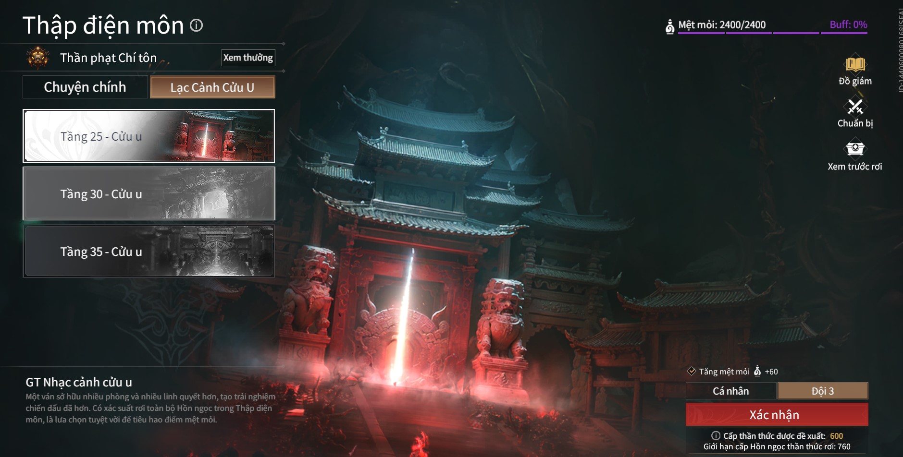

# Nâng cấp thần thức

---
  - Người mới chơi sẽ bắt đầu với thần thức lv 450
  - Lúc này các bạn nên đi mở các ải để mở khóa ngọc và tăng thần thức của mình bằng cách đi các ải Tụ Quật Châu . Đi theo các chương từ 1->4 ( không khuyến khích đi 5 vì thần thức các bạn còn yếu ) và các độ khó từ thường đến ác mộng
  - Nếu bạn đi không nổi hoặc chưa quen cách chơi thì có thể nhờ người kéo để mở map :
  
  - Ngọc rớt ra sẽ có thần thức ngang với thần thức của mình và mỗi ải sẽ có GIỚI HẠN CẤP HỒN NGỌC THẦN THỨC RƠI khác nhau . HIện tại thần thức tối đa mà bạn có thể đạt được là lv780
  - Mức độ rơi của tháp Thập Điện Môn
  - Tầng 1 sẽ có giới hạn thần thức là 600 , từ tầng 1-16 cứ mỗi 1 tầng sẽ tăng 10 điểm giới hạn thần thức
  - Từ tầng 17 trở đi sẽ  có điểm giới hạn thần thức tối đa là 760 ( cao nhất mùa này )
  - Đến tầng 25 của Thập Điện Môn sẽ mở được ải Lạc Cảnh Cửu U (  bạn chưa đến tầng 25 thì có thể nhờ người khác mời bạn vào )
  - Lạc Cảnh Cửu U : nơi các bạn có thể farm thần thức , đồ giám linh quyết , ngọc , lv tướng , v.v
  
  - Những vị tướng thích hợp làm carry cho người mới : Thẩm Diệu , Vô Trần  ,… Hoặc bạn có sở thích support thì có thể chọn Kurumi
  - KHUYẾN KHÍCH: Solo để thuộc đòn Boss

