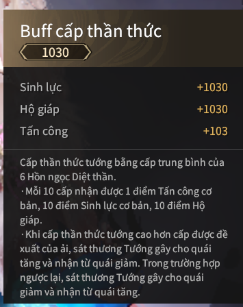

# Sơ lược về thần thức

---
  - Thần thức sẽ tăng các chỉ số cơ bản và sẽ khiến bạn không bị trạng thái áp chế thần thức 
  -  Áp chế thần thức: quái đánh bạn đau hơn, bạn đánh quái dame ít hơn

  

  - Cấp thần thức tối đa mùa giải Sơn lâm là 1030 và đang cập nhật thêm

