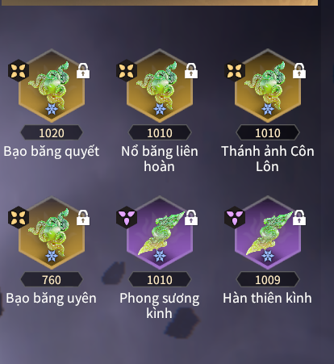
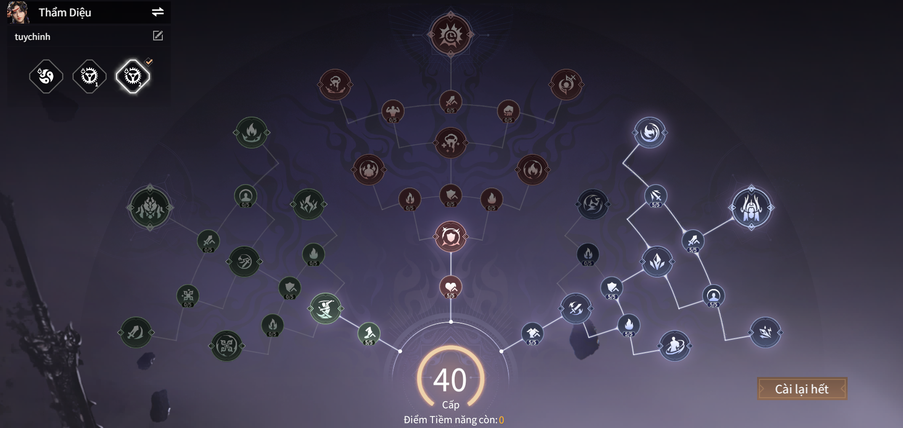

# Showdown Naraka

---

## Đây là bộ ngọc nguyên tố băng cơ bản, là bộ ngọc khởi đầu tương tự bộ chấn chớp
  - **Độ khó :** 3 sao
  - **Sức Mạnh :** Sát thương chủ yếu từ nguyên tố băng và thánh ảnh côn lôn
  - **Ngọc :**

  
  - **Tiềm năng băng :**

  

  - **Điểm mạnh :**
  - Lối chơi cực dễ, không cần nhiều kĩ năng
  - Dame đầu ra ổn, có thể dọn quái, có thể đánh boss  

  - **Điểm yếu :**
  - Cần phải tứ tượng được khi sắp đóng băng (đọc kĩ viên ngọc thánh ảnh côn lôn)
  - Bộ ngọc này gần như bị đào thải do sự lên ngôi của ning hóa khí

  - **Option của ngọc theo độ ưu tiên :**
  - Hợp đạo / Trị lửa (tùy nhân phẩm)
  - ST Phá băng
  - ATK
  - ATK lên Boss
  - Hóa khí
  