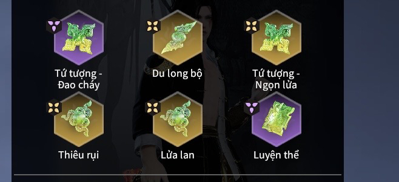
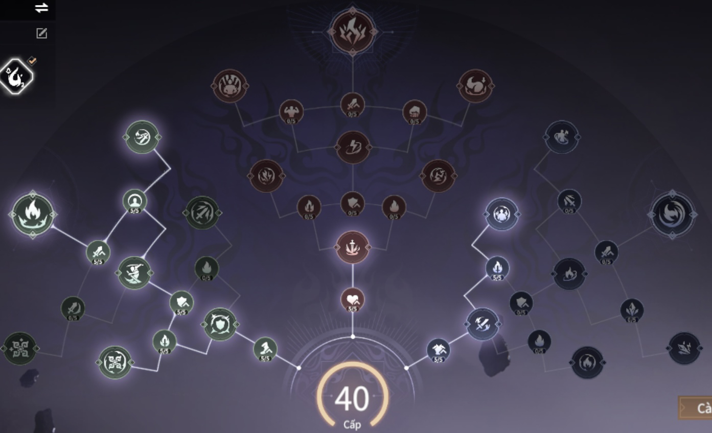

# Dập lửa

---
## Đây là bộ ngọc hot nhất mùa này dame thẳng vào máu boss mà không cần phá cương khí
  - **Độ khó chơi** : 5 sao
  - **Sức mạnh**: Dame lửa đầu ra cao nhất ở mùa biến ảo
  - Kết hợp với du long để dập lửa kết thúc toàn bộ sát thương thiêu đốt
  - Cần trình độ tứ tượng và dash cực chuẩn để tận dụng hết được bộ ngọc

  -  **Ngọc :**

  
  - **Tiềm Năng :**

  
  
  - **Điểm yếu :**
  - Lấy lửa thiêu thân
  - tùy vào tướng mà độ khó của bộ ngọc sẽ giảm

  - **Các tướng khuyến khích :**
  - Thẩm Diệu, Thiên Hải, Quý Thương Hải, (Vô Trần, Matari - yêu cầu trình độ cao)

  - **Lựa chọn thay thế :** Có thể dùng *tứ tượng-tật ngưng/phá cương* thay cho *luyện thể* nếu tay bé, sát thương lửa giảm nhưng tỉ lệ sống xót cao

  
  
  - **Các dòng chỉ số cần đập :**
  - Option hiếm ( Hợp đạo,trị lửa)
  - Sinh Lực ( Tăng damge từ Tiềm Năng Lửa Bùng Thân).
  - Tấn Công 
  - Khôi Phục Tứ Tượng ( Khoảng 2 đến 3 viên full là được, còn muốn dùng full hồi phục thì damge bé)
  - Sát thương lên Boss 