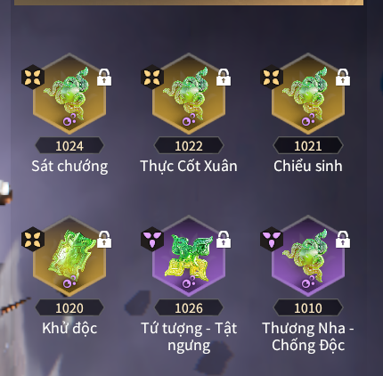
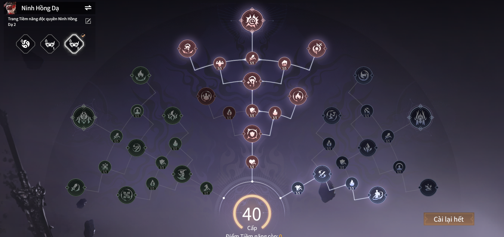

# Showdown Naraka

---

## Đây là bảng ngọc ăn theo bộ lửa điện

 - **Độ khó :** 3 sao
 - **Sức mạnh :** 
 - Dọn quái và đánh boss tốt
 - Không yêu cầu cao như ning độc hóa khí
 - Phù hợp với các tướng áp dụng được thương nha (trừ các tường dùng đại đao, trảm đao)
 - **Ngọc :**

 

 - **Tiềm năng :**

 
 
 - **Điểm yếu :** 
 - Cần tứ tượng để duy trì sát thương cao 

 - **Option của ngọc theo độ ưu tiên:**
  - [Hợp đạo]
  - ATK lên boss  
  - ATK
  - [Trị lửa]
  - ATK bạo độc
  - ATK vũ khí cận chiến
  
