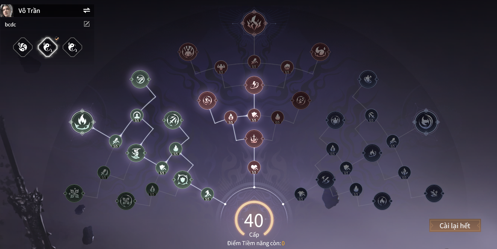
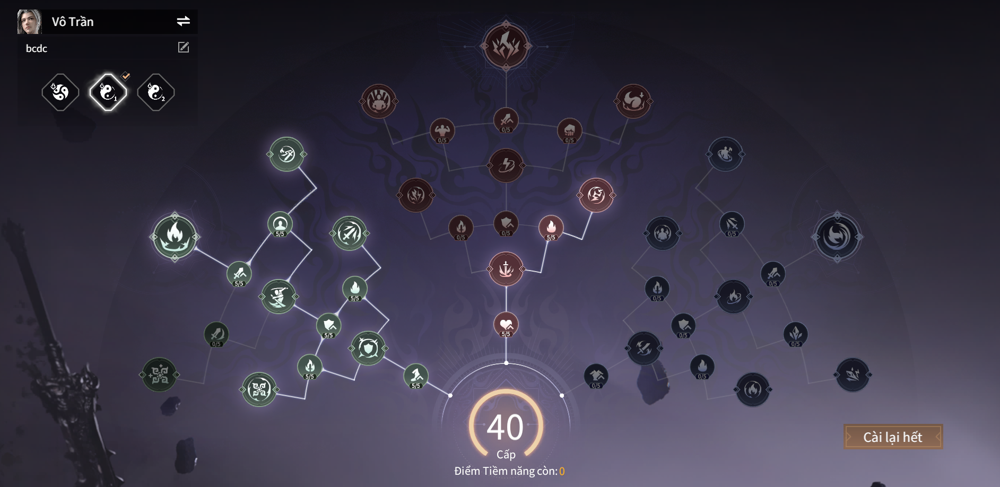

# Lửa Điện

---

## Đây là bảng ngọc có mức dame duy trì tốt nhất ở meta hiện tại 

 - Nói rõ hơn về dame duy trì thì bảng ngọc này không quá ép buộc người chơi phải tứ tượng nhiều mà vẫn có lượng dame ổn định chỉ cần spam *võ thuật phá cương* vô não là được
 - **Độ khó :** 3 sao
 - **Sức mạnh :** 
 - Sạc *tứ tượng ngọn lửa* nhanh
 - Dọn quái đông cực tốt
 - Sát thương duy trì liên tục - không gây ức chế khi đánh quỷ pháp sư 

 - **Ngọc :**

 

 - **Tiềm năng :**
 - option 1

 

 - option 2

 

 - **Điểm yếu :**
 - Cần tứ tượng để duy trì sát thương cao 
 - Lãng phí sát thương thiêu đốt nếu tứ tượng trả đòn liên tục

 - **Lựa chọn thay thế :** Có thể thay *luyện thể* vào *tứ tượng phá cương/ tật ngưng* để sát thương thiêu đốt tăng

  
 - **Các tướng khuyến khích :**
 - Thẩm diệu, Vô trần 

 - **Option của ngọc :**
  - Hợp đạo 
  - Sinh lực
  - ATK
  - ATK lên Boss
  - Khôi phục tứ tượng (nếu thiếu hồi phục- tay bé ..., nói chung không cần thiết lắm) 