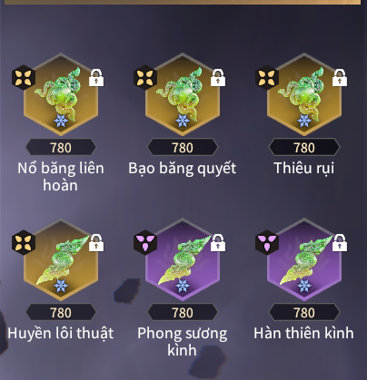
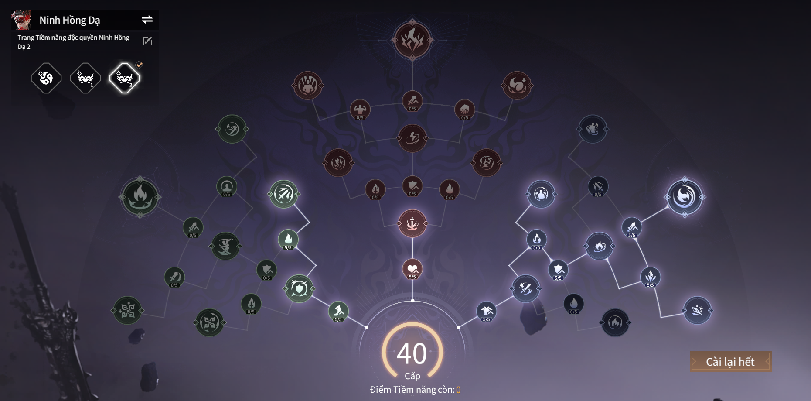

# Viper Ning Hóa Khí

---

## Đây là bộ ngọc dành riêng cho Ning với chức năng đi farm quái cũng như đánh boss cực cháy
  - **Độ khó :** 4 sao
  - **Sức Mạnh :** Sát thương chủ yếu đến từ nổ băng và F của Ning và huyền lôi thuật
  - Cần tận dụng nổ băng sau khi dùng F để hồi chiêu liền 
  - **Ngọc :**

  

  - **Tiềm năng :**

  

  - *Tiềm năng hóa khí Ning chủ yếu vào nhánh băng nứt nước trào và hỏa mộc ngút ngàn còn lại có thể tùy chỉnh để phù hợp với mình
  - **Điểm mạnh :**
  - Lối chơi cực dễ, spam F đến chết
  - Dame đầu ra to, dọn quái mạnh, đánh boss ngon 

  - **Điểm yếu :**
  - Yêu cầu tài nguyên dồn vào cực nhiều (100% hóa khi + 30% sát thương phá băng mỗi viên) để cảm nhận độ sướng của bảng ngọc
  - Ngoài Ning ra thì ít có tướng nào phát huy hết sức mạnh của bảng này được

  - **Option của ngọc :**
  - Hóa khí x 4 (25% x4)
  - Hợp đạo / Trị lửa (tùy nhân phẩm)
  - ST Phá băng
  - ATK
  - ATK lên Boss

