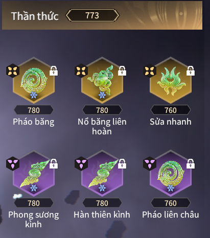
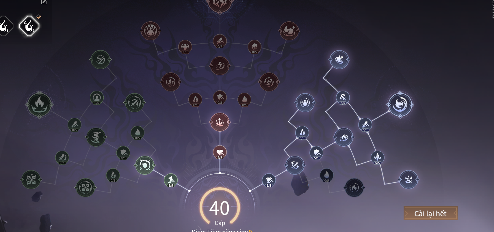
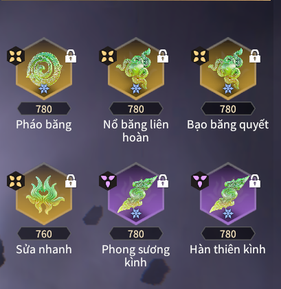

# Showdown Naraka

---

## Đây là bảng ngọc của các top Server hiện tại

 - **Độ khó :** 5 sao
 - **Sức mạnh :** 
 - Lựa chọn cực tốt cho cả boss và quái, phù hợp với mọi tướng
 - Dame đầu cực to do buff trị lửa ở mùa này, hiện tại là bộ ngọc có dame đầu ra to nhất mùa giải
 
 - **Ngọc :**

 

 - **Tiềm năng :**

 
 
 - **Điểm yếu và cách vận hành :** 
 - Độ khó cực cao, yêu cầu người chơi phải **tối ưu được 2 lần dame trị lửa trong một đợt chấn chớp**
 - Cụ thể sau khi chấn đợt lôi đầu hãy dash ngay để kích du long và trả 1 đòn *mini*, sau đó chấn tiếp và lặp lại
 - Vũ khí nhẹ (kiếm, dao găm, quạt, song đao ...) mini = đòn trắng dọc hay ngang đều được
 - Vũ khí trung (côn, thương) mini = đòn trắng dọc
 - vũ khí nặng (đao, trảm đao) mini = đòn trắng ngang
 - Và một điểm yếu nữa là tài nguyên dồn vào bộ ngọc này rất tốn

 - **Lựa chọn thay thế :** Có thể thay *Pháo liên châu* bằng *Thiêu rụi, Bạo băng quyết*

 

 - **Option của ngọc theo độ ưu tiên:**
  - [Trị lửa]
  - [Hợp đạo]  
  - Sinh lực
  - ATK
  - ATK lên Boss
  - Khôi phục tứ tượng / đỡ đòn
  
## ĐÂY CHỈ LÀ BẢNG NGỌC ĐỂ FARM CỬU U NÊN KHÔNG CẦN DỒN TÀI NGUYÊN VÀO - NÓ RẤT PHÍ
